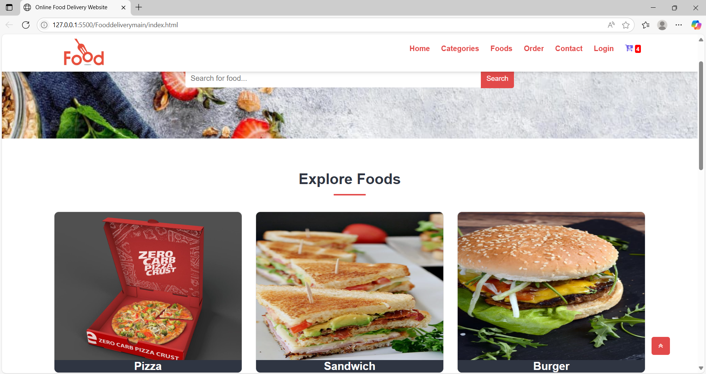

# 🍔 FoodDelivery

A responsive and visually engaging food delivery website built using **HTML**, **CSS**, and **Vanilla JavaScript**. This is a front-end-only project that mimics the user experience of modern online food ordering platforms.

---

## 🌐 Preview



---

## 📁 Project Structure

Fooddeliverymain/
├── css/
│ ├── font-awesome/ # Font Awesome icons
│ ├── hover-min.css # Hover effects
│ └── style.css # Main styling
├── img/
│ ├── category/ # Category images (pizza, burger, etc.)
│ ├── food/ # Food item images
│ ├── logo.png # Website logo
│ └── screenshot.png # README preview image
├── js/
│ └── custom.js # JavaScript interactions
├── index.html # Homepage
├── login.html # Login page
├── order.html # Order summary/cart
├── foods.html # All food items
├── categories.html # Food categories
├── category-foods.html # Items by category
├── contact.html # Contact form
├── food-search.html # Search results
└── README.md # Project documentation

## ✨ Features

- 🔍 Search bar for food lookup
- 📂 Category-based browsing (e.g., Pizza, Sandwich, Burger)
- 🛒 Simple cart/order display
- 🔐 Login form template
- 🎯 Responsive design with hover effects
- 📱 Mobile-friendly layout using media queries
- 🎨 Clean UI with Font Awesome icons

---

## 🚀 Getting Started

1. **Clone the repository**
   ```bash
   git clone https://github.com/Kishore1129/FoodDelivery.git
Open the project

Navigate to the Fooddeliverymain/ folder

Open index.html in your browser

✅ No dependencies
✅ No build tools
✅ Just open and explore!

🛠 Technologies Used
HTML5

CSS3 (Flexbox, Grid, Transitions)

Vanilla JavaScript

Font Awesome (for icons)

📌 Future Enhancements
Add dynamic cart with localStorage

Backend integration for real orders (e.g., Firebase or Node.js)

Add order tracking functionality

Improve form validation and login flow

🤝 Contributing
Pull requests are welcome. If you find bugs or have suggestions, open an issue or fork the repo and contribute!

📄 License
This project is licensed under the MIT License.

🙋‍♂️ Author
Kishore1129
📎 GitHub


---

✅ Let me know if you want:
- A GitHub Pages deployment guide  
- A version with clickable navigation badges  
- License file content (MIT)


